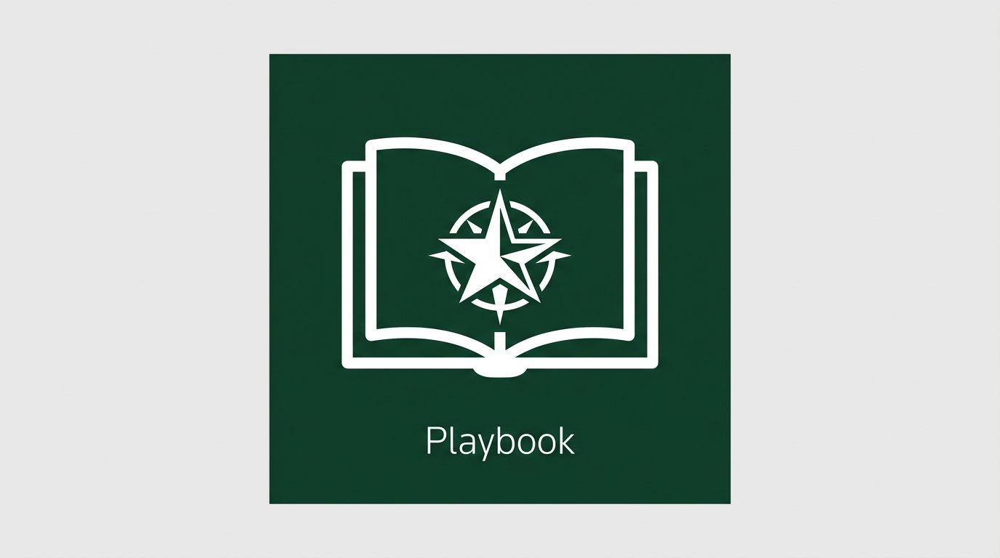
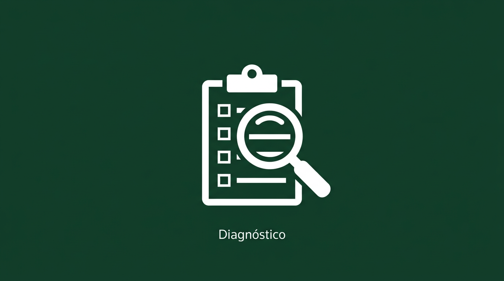
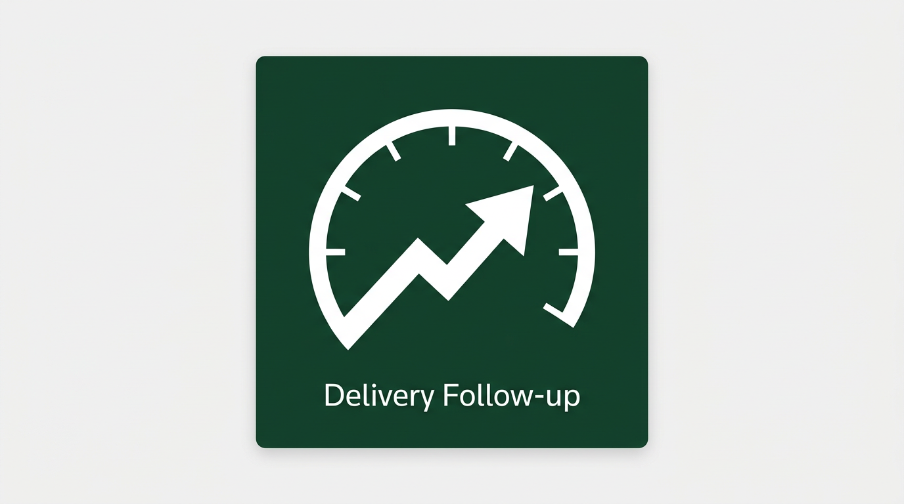
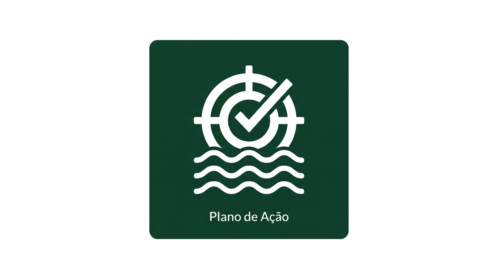

<p align="center">
  
</p>

# TR Change | Forge Enabler

**Forge Enabler** — repositório interno da Thomson Reuters para escalar o modelo de atuação do Change Agent em qualquer vertical.

Playbooks, templates, rituais e artefatos acionáveis para que Change Agents repliquem transformação com clareza, diagnóstico e dados.

---

## Visão

Este repositório é o **sistema nervoso da transformação FORGE**. Ele existe para centralizar toda a documentação de contexto — playbooks, diagnósticos, planos, rituais e métricas — de modo que cada intervenção futura, seja conduzida por humanos ou por **AI Agents**, parta de uma base de conhecimento estruturada, versionada e continuamente enriquecida.

O objetivo é que qualquer Change Agent (humano ou artificial) consiga, a partir deste repositório:

- **Diagnosticar** o estado atual de uma vertical com critérios padronizados
- **Intervir** com planos de ação baseados em ondas de execução e dados reais
- **Acompanhar** a entrega com cadências executivas e KPIs claros
- **Escalar** o modelo para novas verticais sem perda de qualidade ou contexto

> Estamos alinhados ao [Roteiro FORGE](https://github.com/users/mmbTR/projects/2) — o programa de transformação da PE International que visa incorporar Inteligência Artificial em todo o ciclo de desenvolvimento, do entendimento da demanda até o deploy em produção. Este repositório é o enabler que garante que a dimensão de processos, cultura e governança evolua no mesmo ritmo da transformação técnica.

---

## Trilhas

<table>
<tr>
<td align="center" valign="top" width="25%">
<br>
<strong><a href="playbooks/change-agent.html">Playbook</a></strong><br>
<sub>Identidade, pilares, modelo de operação e outcomes do Change Agent</sub>
</td>
<td align="center" valign="top" width="25%">
<br>
<strong><a href="https://github.com/users/mmbTR/projects/2">Diagnóstico</a></strong><br>
<sub>Canvas de avaliação estruturada em 6 blocos com semáforo</sub><br>
<sub>🔨 <em>Em construção — acompanhe no projeto</em></sub>
</td>
<td align="center" valign="top" width="25%">
<br>
<strong><a href="templates/delivery-follow-up/delivery-follow-up.html">Delivery Follow-up</a></strong><br>
<sub>Status executivo quinzenal com KPIs, riscos e enablers</sub>
</td>
<td align="center" valign="top" width="25%">
<br>
<strong><a href="https://github.com/users/mmbTR/projects/2">Plano de Ação</a></strong><br>
<sub>Intervenção estruturada com ondas de execução</sub><br>
<sub>🔨 <em>Em construção — acompanhe no projeto</em></sub>
</td>
</tr>
</table>

---

## Quick Start

### Por que este repositório existe

O FORGE está transformando a forma como a PE International desenvolve software. Não é uma atualização de processo — é uma mudança de mentalidade. O objetivo é que todo o ciclo de desenvolvimento, do entendimento da demanda até o deploy em produção, seja realizado com o apoio de Inteligência Artificial.

Este repositório centraliza a **documentação de contexto da transformação** — o material que permite tanto a um Change Agent humano quanto a um AI Agent futuro compreender o estado de uma vertical, intervir com precisão e acompanhar resultados. Cada artefato aqui é desenhado para ser consumido por pessoas e por máquinas.

### 1. Playbook do Change Agent

Leia o [Playbook](playbooks/change-agent.html) para entender o papel, os pilares de atuação e o modelo de operação. Este é o ponto de partida para qualquer Change Agent — humano ou artificial.

### 2. Diagnóstico de Vertical

> **Em construção.** O template de Diagnóstico está sendo desenvolvido e refinado. Acompanhe o progresso no [Projeto FORGE](https://github.com/users/mmbTR/projects/2).

Ao iniciar atuação em uma nova vertical, o Diagnóstico mapeia o estado atual em 6 dimensões com semáforo de maturidade.

### 3. Delivery Follow-up

A cada cadência quinzenal, use o [Delivery Follow-up](templates/delivery-follow-up/delivery-follow-up.html) para comunicar progresso à liderança. Formatos disponíveis:
- **PPTX** — gere através da aplicação
- **[Guia de utilização](templates/delivery-follow-up/como-funciona/)** — passo a passo completo para Change Agents

### 4. Plano de Ação

> **Em construção.** O template de Plano de Ação está sendo desenvolvido com ondas de execução estruturadas. Acompanhe o progresso no [Projeto FORGE](https://github.com/users/mmbTR/projects/2).

Quando um problema exigir intervenção estruturada, o Plano de Ação organiza a resposta em ondas de execução com critérios claros de avanço.

---

## Estrutura do Repositório

```
TR-Change-Forge/
├── contexto-dominio/               # Documentação organizada por contexto
│   ├── case/                       # Identidade e modelo do Change Agent
│   ├── analises/                   # Diagnóstico e métricas de fluxo
│   ├── relatorios/                 # Delivery Follow-up e Feedback Loop
│   ├── intervencoes/               # Plano de Ação e linguagem de produto
│   └── historico/                  # Governança, rituais e evolução
├── playbooks/
│   └── change-agent.md            # Playbook completo do Change Agent
├── templates/
│   ├── diagnostico/
│   │   ├── diagnostico.md          # Template de diagnóstico (Markdown)
│   │   └── diagnostico.html        # Versão visual interativa
│   ├── delivery-follow-up/
│   │   ├── delivery-follow-up.md   # Template de follow-up (Markdown)
│   │   ├── delivery-follow-up.html # Versão visual executiva
│   │   └── generate_pptx.py       # Gerador de PPTX
│   ├── plano-de-acao/
│   │   ├── plano-de-acao.md        # Template de plano de ação (Markdown)
│   │   └── plano-de-acao.html      # Versão visual interativa
│   └── feedback-loop/
│       ├── feedback-loop.md        # Template de feedback loop trimestral (Markdown)
│       └── feedback-loop.html      # Versão visual interativa
├── rituais/
│   └── governanca.md              # 4 rituais do Change Agent (cadências, agendas, critérios)
├── guias/
│   ├── metricas-de-fluxo.md       # Guia de adoção progressiva de métricas de fluxo
│   └── linguagem-de-produto.md    # Padrão de linguagem de produto para itens de trabalho
├── assets/
│   ├── img/                        # Imagens e ilustrações
│   └── css/                        # CSS compartilhado
├── ROADMAP.md                      # Roadmap do repositório
└── LICENSE
```

---

## Roadmap

Veja o [ROADMAP](ROADMAP.html) para as próximas entregas planejadas.

| Semana | Entrega |
|---|---|
| **S1** | Playbook, Diagnóstico, Delivery Follow-up, Plano de Ação, Guia de Métricas de Fluxo |
| **S2** (concluída) | Rituais de governança, Guia de linguagem de produto, Feedback Loop |
| **S3** | Guia de dashboards e indicadores, Sprint Health Check |
| **S4** | Guia de roadmap trimestral, Fluxo de gestão de demandas |

---

## Identidade Visual

Paleta baseada no padrão Thomson Reuters:

| Token | Cor | Uso |
|---|---|---|
| `--tr-green-dark` | `#133C2C` | Headers, barras principais |
| `--sem-green` | `#22C55E` | Status: ok / concluído |
| `--sem-amber` | `#F59E0B` | Status: atenção / replan |
| `--sem-red` | `#EF4444` | Status: bloqueado / crítico |

CSS compartilhado disponível em [`assets/css/change-system.css`](assets/css/change-system.css).

---

## Como Contribuir

1. Abra uma [Issue](https://github.com/mmbTR/TR-Change-System/issues) para propor melhorias ou novos artefatos
2. Use o template de [Nova Trilha](.github/ISSUE_TEMPLATE/nova-trilha.md) para propostas estruturadas
3. Pull requests são bem-vindos — mantenha o padrão visual e a linguagem em PT-BR

---

## Licença

[MIT](LICENSE) — Thomson Reuters · PE International · 2026
